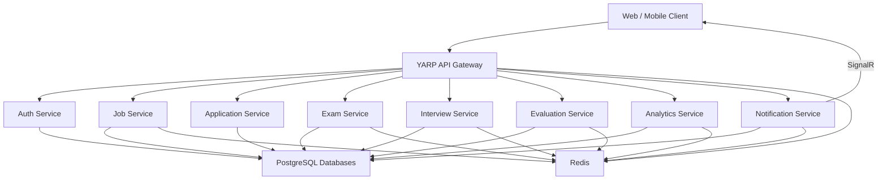

<div align="center">

# Vettingo

### A modular recruitment, candidate vetting and assessment platform

Vettingo brings identity management, job applications, technical exams, structured interviews, evaluations, analytics and real-time notifications together in a microservice-based backend.


</div>

---

## About the Project

Vettingo is a backend platform designed to manage the complete recruitment and candidate evaluation lifecycle.

The platform supports four primary user roles:

- **Admin**
- **Human Resources (HR)**
- **Company**
- **Candidate**

Each business capability is isolated in its own service and exposed through an API Gateway. The services follow a layered, domain-oriented structure with CQRS, validation, caching and role-based authorization.

## Key Features

- JWT-based authentication with access and refresh tokens
- Role-based access control
- Company and user management
- Job posting creation and advanced search
- Candidate application tracking
- Technical exam management
- Multiple-choice, true/false, classic and code-completion questions
- Structured interview exams, questions and answers
- Candidate evaluation management
- Candidate recommendation and CV analysis records
- Job posting performance analytics
- Real-time notifications with SignalR
- Redis-backed query caching
- Gateway-level rate limiting
- Centralized exception handling
- Structured request logging
- Service-focused unit test projects

## Architecture



Most services are separated into the following layers:

```text
API
 └── HTTP endpoints, authentication and middleware

Application
 └── CQRS requests, handlers, validation and business rules

Domain
 └── Entities, enums and domain behavior

Infrastructure
 └── External and technical service implementations

Persistence
 └── Entity Framework Core contexts and repositories
```

## Services

| Service | Responsibility | Main API routes |
|---|---|---|
| **Gateway** | Request routing, CORS and Redis-backed rate limiting | `/auth`, `/job`, `/application`, `/exam`, `/interview`, `/evaluation`, `/analytics`, `/notification` |
| **Auth Service** | Registration, login, token renewal, token revocation, roles and companies | `/api/auth`, `/api/company` |
| **Job Service** | Job posting lifecycle and filtered job searches | `/api/job-postings` |
| **Application Service** | Candidate applications and application status updates | `/api/job-applications` |
| **Exam Service** | Exams and supported technical question types | `/api/exams` |
| **Interview Service** | Interview exams, questions and candidate answers | `/api/interview-exams`, `/api/interview-questions`, `/api/interview-answers` |
| **Evaluation Service** | Candidate evaluation lifecycle | `/api/evaluations` |
| **Analytics Service** | Recommendations, CV analysis and job performance analytics | `/api/analytics` |
| **Notification Service** | Stored notifications, unread state and real-time delivery | `/api/notifications`, `/notification-hub` |

## Roles and Authorization

| Role | Purpose |
|---|---|
| **Admin** | Platform-level administration and company management |
| **Human Resources** | Dedicated HR identity for recruitment and candidate management teams |
| **Company** | Employer-side job, assessment, interview and analytics operations |
| **Candidate** | Job applications, assessments, interviews, evaluations and personal analytics |

> The exact seeded name of the HR role is `Human Resources`.

JWTs include the user's role in the `Role` claim. API endpoints use role-based authorization policies to protect business operations.

## Technology Stack

| Area | Technologies |
|---|---|
| Runtime | .NET 10 |
| API | ASP.NET Core Web API |
| Architecture | Microservices, layered architecture, CQRS |
| Request mediation | FlashMediator |
| Database
