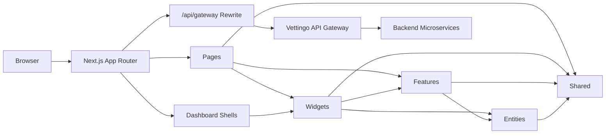
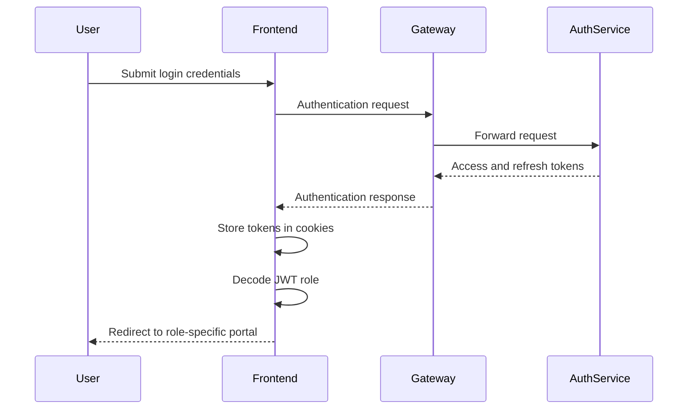

<div align="center">

# Vettingo Frontend

### A role-driven recruitment and candidate experience built for modern hiring workflows

Vettingo Frontend provides dedicated experiences for candidates, employers, and human resources teams while connecting recruitment workflows through a single Next.js application.

<br />


</div>

---

## Overview

**Vettingo Frontend** is the user-facing application of the Vettingo recruitment and candidate vetting platform.

The application combines public job discovery, authentication, candidate workflows, employer recruitment tools, HR operations, assessments, candidate analysis, and talent benchmarking in a single role-aware interface.

It is built with **Next.js 16**, **React 19**, **TypeScript**, and **Tailwind CSS 4** using the App Router and a Feature-Sliced Design-inspired frontend architecture.

### User experiences

- **Candidate**
- **Company / Employer**
- **Human Resources (HR)**

The frontend maps the backend `Company` role to the Employer portal and the `Human Resources` role to the HR portal.

---

## Features

### Public experience

- Product landing page
- User login and registration
- Public job discovery
- Job search and filtering
- Responsive navigation
- Light and dark theme support

### Candidate experience

- Candidate dashboard
- Application history
- Application status tracking
- Upcoming interview overview
- Recommended job listings
- Skill radar and competency insights
- Candidate self-analysis
- Resume upload workflow
- Technical assessment introduction
- Timed assessment sessions
- Candidate settings
- Candidate help center

### Employer experience

- Employer dashboard
- Job listing management
- Application management
- Candidate application details
- Talent pool
- Candidate talent profiles
- Candidate competency analysis
- Job requisition creation
- Employer account settings
- Employer help center

### Human Resources experience

- HR dashboard
- Recruitment requisitions
- Candidate pipeline
- Interview agenda
- Hiring reports
- Department metrics
- Recruitment funnel insights
- Monthly hiring analytics
- HR settings
- HR help center

### Shared platform features

- JWT-based session handling
- Role-aware portal redirects
- Gateway-based backend communication
- Route-level loading states
- Reusable dashboard shells
- Responsive layouts
- Accessible form controls
- Light and dark themes
- Reduced-motion support
- Type-safe API models

---

## Application architecture

The application uses the **Next.js App Router** for routing and a Feature-Sliced Design-inspired structure for business and presentation logic.



### Dependency direction

The frontend layers follow a one-way dependency flow:

```text
app → pages → widgets → features → entities → shared
```

Higher-level layers may use lower-level layers. Shared utilities and components remain independent from business-specific pages.

---

## Design principles

### Role-first user experience

Candidate, Employer, and HR users receive dedicated navigation, dashboards, workflows, and information hierarchy.

Each portal is designed around the tasks most relevant to that role.

### Thin route components

Files inside `app/` primarily define routes, metadata, layouts, and loading boundaries.

The actual page implementations are placed under `src/layers/pages`, keeping routing separate from UI composition.

```tsx
import { CandidateDashboardPage } from "@/pages/candidate-dashboard";

export default function CandidatePage() {
  return <CandidateDashboardPage />;
}
```

### Clear layer boundaries

Business concepts, interactive features, large UI sections, and route-level pages are separated into dedicated layers.

| Layer | Responsibility |
|---|---|
| **app** | Next.js routes, layouts, metadata, and loading boundaries |
| **pages** | Full page compositions |
| **widgets** | Large reusable interface sections |
| **features** | User actions, API operations, and feature state |
| **entities** | Domain models and presentation data |
| **shared** | Reusable API, authentication, configuration, hooks, and UI |

### Server and client separation

The application uses server-side functionality for operations such as authentication cookies while keeping interactive experiences inside focused Client Components.

This reduces unnecessary client-side JavaScript and keeps browser-only behavior isolated.

### Responsive by default

Layouts use Tailwind CSS responsive utilities to adapt navigation, grids, cards, forms, dashboards, and tables across different screen sizes.

The interface is designed for:

- Desktop
- Tablet
- Mobile

### Accessible interactions

The UI uses semantic HTML, ARIA attributes, descriptive labels, keyboard-friendly controls, and status announcements.

Loading screens include accessible states such as:

```tsx
<main
  aria-busy="true"
  aria-label="Aday paneli yükleniyor"
  role="status"
>
```

### Reduced-motion support

Animations respect the user's reduced-motion preferences.

```css
@media (prefers-reduced-motion: reduce) {
  /* Motion-sensitive effects are disabled or reduced */
}
```

### Consistent loading experience

Every application route includes a corresponding `loading.tsx` boundary.

Skeleton screens maintain the layout hierarchy while content and route segments are loading.

### Consistent visual language

The application uses:

- Geist Sans and Geist Mono
- Shared color tokens
- Consistent borders and spacing
- Reusable dashboard shells
- Reusable Material Icon rendering
- Page-specific loading skeletons
- Shared light and dark theme behavior

---

## Technology stack

| Category | Technology |
|---|---|
| **Framework** | Next.js 16.2.6 |
| **UI library** | React 19.2.4 |
| **Language** | TypeScript 5 |
| **Styling** | Tailwind CSS 4 |
| **Routing** | Next.js App Router |
| **Authentication utilities** | JOSE |
| **Session storage** | Server-managed cookies |
| **API integration** | Fetch API, Next.js rewrites |
| **State management** | React hooks and feature-level state |
| **Fonts** | Geist Sans, Geist Mono |
| **Static analysis** | ESLint 9 |
| **Package manager** | npm |

The project uses a custom Tailwind-based component system instead of a third-party UI component library.

---

## Role mapping

| Backend role | Frontend experience | Default route |
|---|---|---|
| `Candidate` | Candidate portal | `/candidate` |
| `Company` | Employer portal | `/employer` |
| `Human Resources` | HR portal | `/hr` |

Authentication responses are decoded with JOSE and users are redirected to the appropriate portal according to their JWT role claim.

---

## Project structure

```text
vettingo/
├── app/
│   ├── assessment/
│   ├── candidate/
│   ├── employer/
│   ├── hr/
│   ├── jobs/
│   ├── login/
│   ├── register/
│   ├── resume-upload/
│   ├── talent-benchmarking/
│   ├── globals.css
│   └── layout.tsx
│
├── public/
│   ├── icons/
│   └── images/
│
├── src/
│   └── layers/
│       ├── entities/
│       ├── features/
│       ├── pages/
│       ├── shared/
│       └── widgets/
│
├── .env.example
├── eslint.config.mjs
├── next.config.ts
├── package.json
├── package-lock.json
├── postcss.config.mjs
├── proxy.ts
└── tsconfig.json
```

### Import alias

The `@/` alias points to `src/layers/`.

```json
{
  "paths": {
    "@/*": ["./src/layers/*"]
  }
}
```

Example:

```tsx
import { CandidateShell } from "@/widgets/candidate/shell";
import { ThemeToggle } from "@/shared/ui/theme-toggle";
```

---

## Layer structure

### Entities

Domain-oriented models and presentation data:

```text
entities/
├── assessment/
├── candidate-analysis/
├── candidate-dashboard/
├── employer-dashboard/
├── employer-recruiting/
├── hr-dashboard/
├── job/
├── job-requisition/
├── landing/
├── resume/
└── talent-benchmark/
```

### Features

User actions, API integration, and feature state:

```text
features/
├── assessment-access/
├── assessment-session/
├── auth/
├── candidate-analysis/
├── candidate-dashboard/
└── job-search/
```

### Widgets

Large reusable UI sections:

```text
widgets/
├── candidate/
│   ├── application-history/
│   ├── dashboard-applications/
│   ├── recommended-jobs/
│   ├── shell/
│   ├── skill-radar/
│   └── upcoming-interviews/
│
├── employer/
│   ├── application-list/
│   ├── job-list/
│   ├── shell/
│   └── talent-list/
│
└── hr/
    ├── candidate-pipeline/
    ├── interview-agenda/
    ├── requisition-board/
    └── shell/
```

### Shared

Application-independent functionality:

```text
shared/
├── api/
├── auth/
├── config/
├── ui/
└── useUserInformation/
```

---

## Application routes

### Public and shared routes

| Route | Description |
|---|---|
| `/` | Product landing page |
| `/login` | User login |
| `/register` | User registration |
| `/jobs` | Job discovery and search |
| `/jobs/new` | Job requisition wizard |
| `/resume-upload` | Resume upload workflow |
| `/assessment` | Assessment introduction |
| `/assessment/session` | Active assessment session |
| `/talent-benchmarking` | Talent comparison and benchmarking |
| `/mycandidate` | Candidate self-analysis |

### Candidate routes

| Route | Description |
|---|---|
| `/candidate` | Candidate dashboard |
| `/candidate/applications` | Candidate applications |
| `/candidate/help-center` | Candidate help center |
| `/candidate/settings` | Candidate account settings |

### Employer routes

| Route | Description |
|---|---|
| `/employer` | Employer dashboard |
| `/employer/jobs` | Employer job listings |
| `/employer/applications` | Application management |
| `/employer/applications/[id]` | Candidate application analysis |
| `/employer/talents` | Talent pool |
| `/employer/talents/[id]` | Candidate talent profile |
| `/employer/help-center` | Employer help center |
| `/employer/settings` | Employer settings |

### HR routes

| Route | Description |
|---|---|
| `/hr` | HR dashboard |
| `/hr/requisitions` | Recruitment requisitions |
| `/hr/candidates` | Candidate pipeline |
| `/hr/interviews` | Interview agenda |
| `/hr/reports` | Recruitment reports |
| `/hr/help-center` | HR help center |
| `/hr/settings` | HR settings |

---

## Backend integration

The frontend communicates with the Vettingo backend through the API Gateway.

Frontend requests use the following local rewrite:

```text
/api/gateway/:path*
        ↓
VETTINGO_GATEWAY_URL/:path*
```

Example:

```text
/api/gateway/job/job-postings/search
```

The rewrite destination is configured in `next.config.ts`.

### Integrated service areas

- Authentication
- Job search
- Job postings
- Job applications
- Candidate interviews
- Candidate evaluations
- Candidate dashboard data

Feature-specific API modules keep DTOs and request logic close to the features that use them.

```text
features/
├── auth/api/
├── job-search/api/
├── candidate-dashboard/api/
└── candidate-analysis/api/
```

Some presentation-heavy screens use domain data modules under `entities/`. This separation allows demo data to be replaced with backend implementations without coupling it directly to page components.

---

## Authentication flow



The application uses:

- `access_token` cookie
- `refresh_token` cookie
- JWT role decoding with JOSE
- Role-aware redirects
- Route proxy checks
- Authorization headers for backend requests

Candidate and Employer route groups are included in the Next.js proxy matcher for session and role checks.

---

## Theme system

The application supports light and dark themes.

The selected theme is stored under:

```text
vettingo-theme
```

Theme preference is persisted in `localStorage` and applied before the page becomes interactive to reduce theme flickering during initial rendering.

The active dark theme is represented by the following root class:

```text
theme-dark
```

Theme-sensitive styles are maintained in `app/globals.css`.

---

## Loading states

Every route contains a dedicated `loading.tsx` file.

Loading screens use:

- Skeleton components
- Pulse animations
- Reduced-motion fallbacks
- `aria-busy`
- `role="status"`
- Screen-reader-only loading descriptions

This creates consistent feedback during navigation and asynchronous data loading.

---

## Getting started

### Prerequisites

Make sure the following tools are installed:

- [Node.js 20.9 or newer](https://nodejs.org/)
- npm
- Git
- A running [Vettingo backend](https://github.com/emreucbudak/Vettingo) for live API data

Check your Node.js version:

```bash
node --version
```

---

## Installation

### Clone the repository

```bash
git clone https://github.com/emreucbudak/Vettingo-Frontend.git
cd Vettingo-Frontend/vettingo
```

### Install dependencies

For a reproducible installation using the lockfile:

```bash
npm ci
```

Alternatively:

```bash
npm install
```

---

## Environment configuration

Create a `.env.local` file from the included example:

```bash
cp .env.example .env.local
```

Configure the Vettingo API Gateway address:

```env
VETTINGO_GATEWAY_URL=http://localhost:5135
```

When the variable is not provided, the application uses the following default:

```text
http://localhost:5135
```

Restart the development server after changing environment variables.

---

## Running the application

Start the development server:

```bash
npm run dev
```

Open the application:

```text
http://localhost:3000
```

---

## Production build

Create an optimized production build:

```bash
npm run build
```

Start the production server:

```bash
npm run start
```

---

## Available scripts

| Command | Description |
|---|---|
| `npm run dev` | Starts the Next.js development server |
| `npm run build` | Creates an optimized production build |
| `npm run start` | Runs the production build |
| `npm run lint` | Runs ESLint static analysis |

Run code-quality checks:

```bash
npm run lint
```

---

## Development guidelines

When adding a new route:

1. Create the route entry under `app/`.
2. Keep the route component focused on composition and metadata.
3. Place the full page implementation under `src/layers/pages`.
4. Add a dedicated `loading.tsx`.
5. Reuse existing widgets and shared UI components.
6. Keep business-specific logic inside `features`.
7. Keep domain models inside `entities`.

When adding a new API integration:

1. Define request and response types close to the feature.
2. Send requests through the shared Gateway path.
3. Handle loading, success, empty, and error states.
4. Support request cancellation where appropriate.
5. Avoid placing network logic directly inside presentation components.

When adding reusable UI:

- Use `shared/ui` for application-independent components.
- Use `widgets` for large role-specific interface sections.
- Follow the existing spacing and color language.
- Support light and dark themes.
- Preserve responsive behavior.
- Include accessible labels and status messages.
- Respect reduced-motion preferences.

---

## Related repository

The backend services, API Gateway, authentication, persistence, and business workflows are maintained in the following repository:

[Vettingo Backend](https://github.com/emreucbudak/Vettingo)

---

<div align="center">

Built with **Next.js 16**, **React 19**, **TypeScript**, and **Tailwind CSS 4**.

</div>
